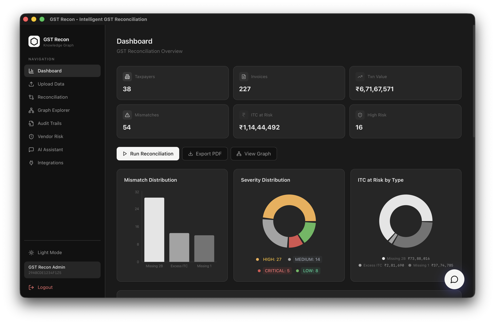
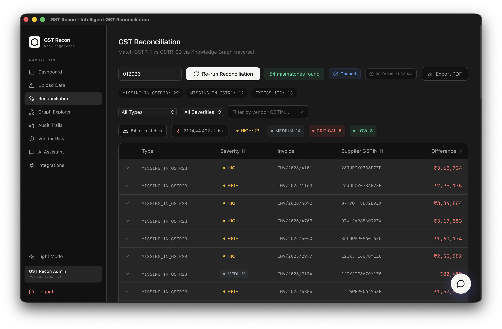
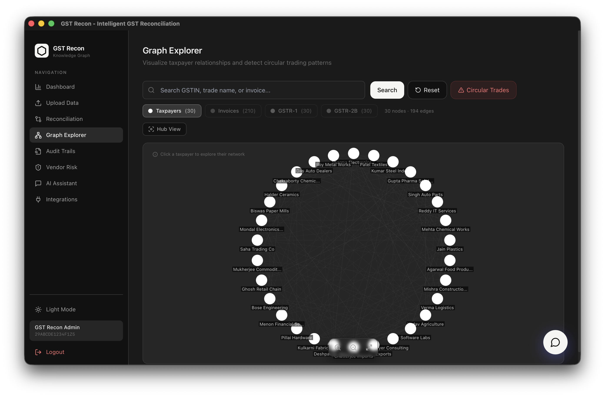
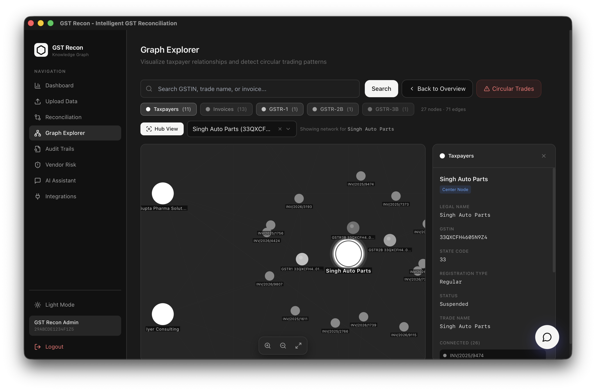
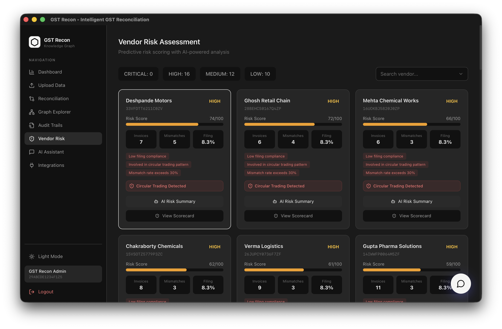
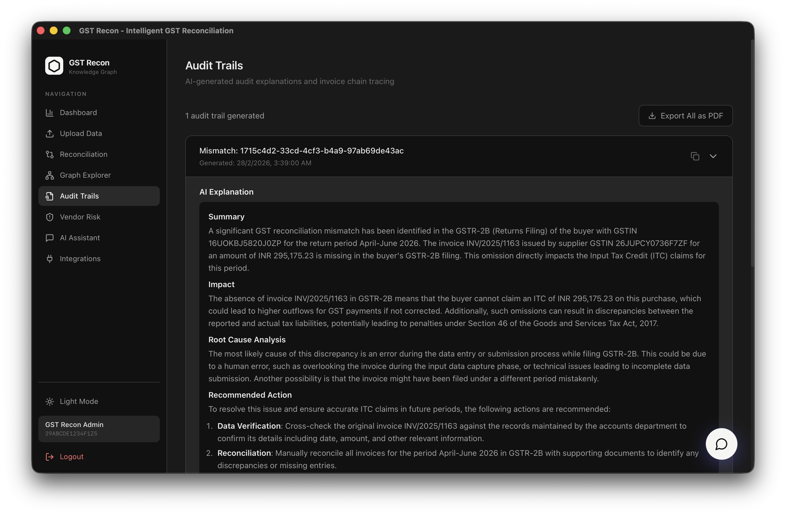
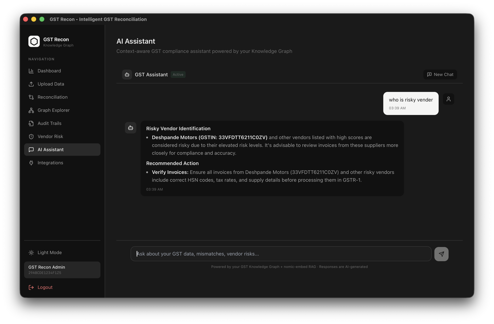
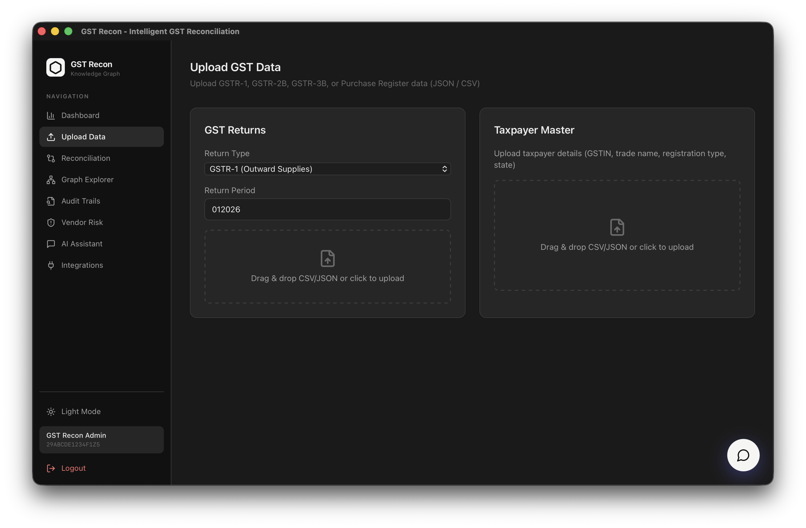
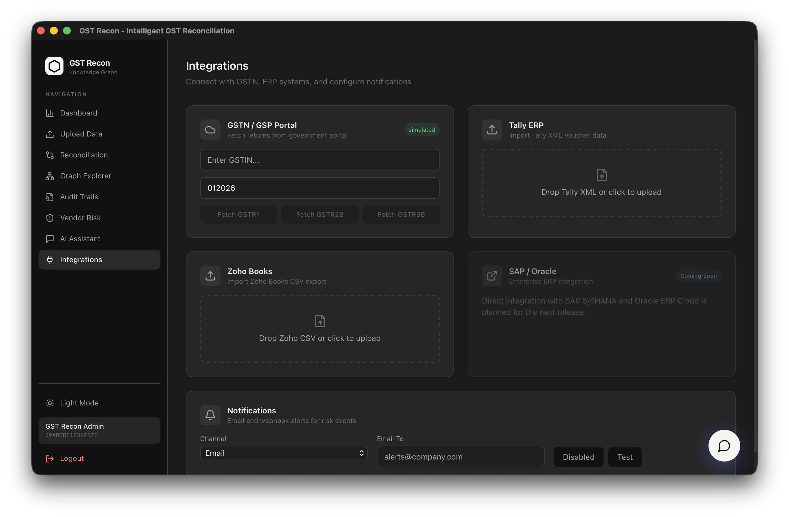
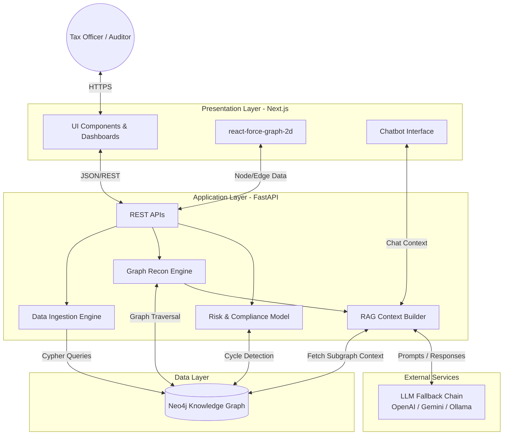

<p align="center">
  
</p>

# GST Recon - Intelligent GST Reconciliation

GST Recon is an intelligent tax reconciliation engine that uses a Neo4j Knowledge Graph to match GSTR-1 (seller's outward supplies) against GSTR-2B (auto-generated buyer's inward supplies). It detects ITC mismatches, circular trading fraud, and vendor compliance risk — with LLM-powered audit trail generation and an AI assistant that understands your entire tax graph.

---

## Video Presentation

[Watch the video](https://drive.google.com/file/d/1cSXTdYlhV6SeLbRbnMfHOqHaeGvPIsF9/view?usp=sharing)

## Test Credentials

| Field    | Value      |
| -------- | ---------- |
| Username | `admin`    |
| Password | `admin123` |

---

## Problem

Indian businesses must reconcile three GST returns every month — GSTR-1, GSTR-2B, and GSTR-3B. Mismatches between these returns put Input Tax Credit (ITC) at risk, and undetected circular trading patterns can trigger fraud investigations. Manual reconciliation across thousands of invoices is slow, error-prone, and misses the systemic patterns hidden in supplier networks.

## Solution

GST Recon ingests all GST return data into a Neo4j knowledge graph where taxpayers, invoices, and returns become interconnected nodes. Reconciliation runs as graph traversal:

1. **Ingest** — Upload GSTR-1, GSTR-2B, GSTR-3B, e-Invoices, e-Way Bills, and purchase register data (CSV/JSON).
2. **Graph Build** — Taxpayers, invoices, and returns are created as nodes with `SUPPLIED_BY`, `SUPPLIED_TO`, `TRADES_WITH`, `CONTAINS_OUTWARD`, and `CONTAINS_INWARD` relationships.
3. **Reconcile** — Cypher queries traverse the graph to find missing invoices, value mismatches, rate mismatches, excess ITC claims, and duplicates.
4. **Risk Score** — Each vendor gets a composite risk score from 4 weighted factors: filing compliance, mismatch frequency, circular trading involvement, and volume anomalies.
5. **Detect Fraud** — Circular trading detection finds closed loops (A→B→C→A) in the `TRADES_WITH` graph.
6. **Audit Trail** — LLM generates human-readable explanations for every mismatch: root cause analysis, impact assessment, and recommended actions.
7. **AI Assistant** — Context-aware chatbot powered by the knowledge graph answers natural language questions about your GST data, mismatches, and vendor risks.

---

## Screenshots

### Dashboard — Real-time overview with mismatch distribution, severity breakdown, and ITC at risk



### GST Reconciliation — Sortable, filterable mismatch table with severity indicators and PDF export



### Graph Explorer — Full taxpayer network with circular trade detection



### Graph Explorer — Hub view with taxpayer detail panel showing GSTIN, connections, and metadata



### Vendor Risk Assessment — Composite risk scoring with AI-powered summaries and scorecards



### Audit Trails — LLM-generated explanations with root cause analysis and recommended actions



### AI Assistant — Context-aware GST compliance chatbot powered by the Knowledge Graph



### Upload Data — Drag-and-drop ingestion for GST returns and taxpayer master data



### Integrations — GSTN portal, Tally ERP, Zoho Books connectors and notification configuration



---

## Architecture

```
CSV/JSON Upload
      |
      v
FastAPI Backend ──────── Neo4j Knowledge Graph
      |                        |
      ├─ Ingest Router         ├─ Taxpayer nodes
      ├─ Reconcile Engine      ├─ Invoice nodes
      ├─ Risk Scorer           ├─ GSTR-1/2B/3B Return nodes
      ├─ LLM Audit Chain       ├─ E-Invoice / E-Way Bill nodes
      ├─ GSTN Mock API         ├─ SUPPLIED_BY / SUPPLIED_TO edges
      ├─ ERP Connectors        ├─ TRADES_WITH edges (aggregated)
      └─ Notifications         └─ CONTAINS_OUTWARD / INWARD edges
      |
      v
Next.js Frontend (Tauri Desktop App)
      |
      ├─ Dashboard (Recharts + Nivo Sankey)
      ├─ Graph Explorer (react-force-graph-2d)
      ├─ Reconciliation Table (sortable, filterable, PDF export)
      ├─ Vendor Risk Cards + Scorecards
      ├─ AI Assistant (RAG chat)
      ├─ Audit Trail Viewer
      └─ Integrations Hub
```

Frontend communicates with the backend via REST API. In production, Nginx reverse-proxies `gst.niheshr.com` → Next.js and `gst-api.niheshr.com` → FastAPI.

---

## Key Features

**Knowledge Graph Reconciliation** — Invoices, taxpayers, and returns live as interconnected nodes in Neo4j. Reconciliation is graph traversal, not flat table joins. This catches systemic patterns that spreadsheet-based tools miss.

**Circular Trading Detection** — Finds closed loops in the `TRADES_WITH` relationship graph (A sells to B, B sells to C, C sells back to A) — a known pattern for GST fraud involving fake invoices and inflated ITC claims.

**Composite Vendor Risk Scoring** — Four weighted factors: filing compliance (25%), mismatch frequency (30%), circular trading involvement (25%), and volume anomalies (20%). Thresholds: CRITICAL >= 75, HIGH >= 50, MEDIUM >= 25.

**LLM-Powered Audit Trails** — Every mismatch gets a human-readable explanation generated by an LLM (OpenAI, Gemini, or Ollama). Includes summary, impact assessment, root cause analysis, and recommended corrective actions.

**AI Assistant** — Context-aware chatbot that queries the knowledge graph to answer questions like "which vendors are risky?", "show me excess ITC claims", or "what's the mismatch trend this quarter?".

**ITC Flow Analysis** — Sankey diagram visualising the flow from ITC Claimed (GSTR-3B) → ITC Eligible (GSTR-2B) → ITC Matched → ITC At Risk.

**Multi-Period Trends** — Period-over-period charts tracking mismatches, invoice volume, and ITC at risk across filing periods.

**ERP Integration** — Import data directly from Tally (XML vouchers), Zoho Books (CSV export), and SAP. GSTN/GSP portal simulation for fetching returns.

**Desktop App** — Ships as a native macOS/Windows/Linux app via Tauri v2. Also runs as a standard web app.

---

## Tech Stack

| Layer       | Technology                                                     |
| ----------- | -------------------------------------------------------------- |
| Desktop     | Tauri v2 (Rust)                                                |
| Frontend    | Next.js 14, TypeScript, Tailwind CSS                           |
| Charts      | Recharts (bar, pie, area), Nivo (Sankey)                       |
| Graph Viz   | react-force-graph-2d, D3.js force simulation                   |
| Backend     | Python 3.11, FastAPI, uvicorn                                  |
| Graph DB    | Neo4j 5.26 Community (Cypher queries, APOC plugin)             |
| LLM         | OpenAI / Google Gemini / Ollama (fallback chain)               |
| Risk Model  | Custom composite scorer (4 weighted factors)                   |
| Data Models | Pydantic v2 (GSTIN regex validation, strict typing)            |
| Deployment  | Docker Compose, Nginx, Let's Encrypt SSL                       |

---

## Getting Started

### Prerequisites

- Python 3.11+
- Node.js 18+
- Docker (for Neo4j)
- Ollama running locally (optional, for local LLM), or an OpenAI/Gemini API key

### Quick Start

```bash
# 1. Start Neo4j
docker compose up neo4j -d

# 2. Backend
cd backend
uv sync
uv run uvicorn app.main:app --reload    # runs on :8000

# 3. Frontend
cd frontend
npm install
npm run dev                              # runs on :3000

# 4. Generate and seed sample data
python3 data/generator/mock_gst_data.py
python3 data/generator/seed_neo4j.py
```

Open http://localhost:3000 and hit "Run Reconciliation" on the dashboard.

### Desktop App (Tauri)

```bash
cd frontend
npm run tauri:dev       # development
npm run tauri:build     # production binary
```

### Full Stack (Docker Compose)

```bash
docker compose up -d    # neo4j + backend + frontend + caddy
```

### Configuration

Settings are read from `backend/.env`:

| Variable         | Default                          | Description                        |
| ---------------- | -------------------------------- | ---------------------------------- |
| NEO4J_URI        | bolt://localhost:7687            | Neo4j connection                   |
| NEO4J_USER       | neo4j                           | Neo4j username                     |
| NEO4J_PASSWORD   | gstrecon2026                     | Neo4j password                     |
| OPENAI_API_KEY   | (none)                           | OpenAI key for audit/chat          |
| GEMINI_API_KEY   | (none)                           | Google Gemini key (fallback)       |
| OLLAMA_URL       | http://localhost:11434           | Local Ollama server                |
| LLM_PRIORITY     | openai,gemini,ollama             | LLM fallback order                 |

LLM is optional — if no keys are set, audit and chat features return a fallback message instead of crashing.

---

## API

| Method | Path                                 | Description                                    |
| ------ | ------------------------------------ | ---------------------------------------------- |
| POST   | /api/data/upload                     | Upload CSV/JSON (GSTR-1, 2B, 3B, taxpayers)   |
| POST   | /api/reconcile                       | Trigger reconciliation for a return period     |
| GET    | /api/reconcile/results               | Paginated, filterable mismatch results         |
| GET    | /api/reconcile/graph/nodes           | Full knowledge graph (nodes + edges)           |
| GET    | /api/reconcile/graph/circular-trades | Detect circular trading patterns               |
| GET    | /api/reconcile/graph/taxpayer-network| Hub view for a specific GSTIN                  |
| POST   | /api/audit/generate                  | LLM-generated audit explanation for a mismatch |
| GET    | /api/risk/vendors                    | All vendors with composite risk scores         |
| GET    | /api/risk/vendors/{gstin}/scorecard  | Detailed vendor scorecard                      |
| GET    | /api/stats/dashboard                 | Dashboard aggregates                           |
| GET    | /api/stats/itc-flow                  | ITC flow data for Sankey diagram               |
| GET    | /api/stats/trends                    | Period-over-period trend data                  |
| POST   | /api/gstn/fetch-gstr1                | Fetch GSTR-1 from simulated GSTN portal        |
| POST   | /api/erp/import/tally                | Import Tally XML vouchers                      |
| POST   | /api/erp/import/zoho                 | Import Zoho Books CSV                          |
| POST   | /api/notifications/configure         | Configure email/webhook notifications          |

---

## Knowledge Graph Schema

**Nodes:**
- `Taxpayer` — keyed on GSTIN (15-char Indian tax ID)
- `Invoice` — keyed on composite `supplierGSTIN_invoiceNumber_period`
- `GSTR1Return` / `GSTR2BReturn` / `GSTR3BReturn` — filed returns per period
- `EInvoice` — IRN-keyed electronic invoices
- `EWayBill` — transport documents for goods movement

**Relationships:**
- `SUPPLIED_BY` (Invoice → Taxpayer) — seller
- `SUPPLIED_TO` (Invoice → Taxpayer) — buyer
- `TRADES_WITH` (Taxpayer → Taxpayer) — aggregated trading relationship
- `CONTAINS_OUTWARD` (GSTR1Return → Invoice) — outward supply declaration
- `CONTAINS_INWARD` (GSTR2BReturn → Invoice) — inward supply auto-population
- `GENERATES` (EInvoice → Invoice) — e-invoice linkage
- `COVERS` (EWayBill → Invoice) — transport coverage

---

## Deployment

Production runs at `gst.niheshr.com` (frontend) and `gst-api.niheshr.com` (backend).

```bash
# Nginx configs in nginx/
sudo ln -s /path/to/nginx/gst.niheshr.com.conf /etc/nginx/sites-enabled/
sudo ln -s /path/to/nginx/gst-api.niheshr.com.conf /etc/nginx/sites-enabled/
sudo certbot certonly --standalone -d gst.niheshr.com -d gst-api.niheshr.com
sudo nginx -t && sudo systemctl reload nginx
```

---

Built for ACM-KLH Hackathon — Problem Statement: Intelligent GST Reconciliation using Knowledge Graphs
